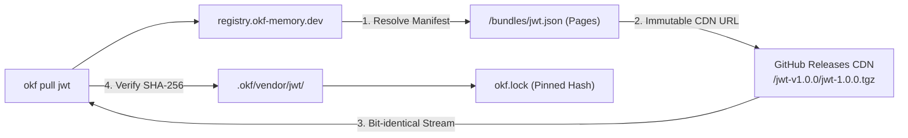
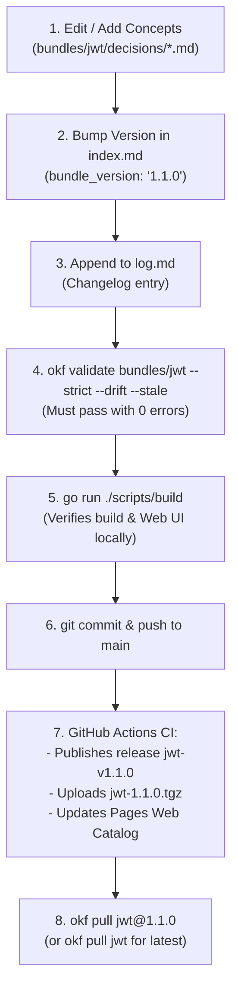

# OKF Memory Registry (`registry.okf-memory.dev`)

> The canonical knowledge bundle registry for Open Knowledge Format (OKF) v0.2 AI agent memory ecosystems.

This repository serves as the authoritative, cryptographically verifiable distribution point for official seed bundles and community-curated knowledge packs. It provides both an interactive web catalog and a machine-readable JSON API consumed by the `okf` CLI and AI coding agents.

* **Web Catalog:** [https://registry.okf-memory.dev](https://registry.okf-memory.dev)
* **Specification:** [Open Knowledge Format v0.2](https://okf-memory.dev/#architecture)
* **Agent CLI:** [`okf-agent-memory`](https://github.com/okf-memory/okf-agent-memory)

---

## Architecture & Storage Model

To guarantee **100% hash stability** and prevent lockfile drift across agent installations:
1. **Catalog & Manifests:** GitHub Pages (`registry.okf-memory.dev`) hosts the lightweight index, version manifests (`/bundles/<id>-<version>.json`), and latest pointer manifests (`/bundles/<id>.json`).
2. **Immutable Release Storage:** The bit-identical `.tgz` archives are automatically published as **GitHub Release Assets** (`<id>-v<version>`). They are permanently hosted on GitHub's geo-distributed CDN, completely immutable, and never expire.



---

## Governance & Distribution Model

OKF is designed to be **100% permissionless and decentralized**:

1. **Decentralized Community Bundles (Primary Path):**
   * Anyone can author and distribute an OKF bundle directly from their own GitHub repository without opening a Pull Request or registering an account.
   * **Decentralized Ecosystem Discovery:** Tag your repository with the GitHub topic [`okf-memory-bundle`](https://github.com/topics/okf-memory-bundle) (and optionally `okf-memory`). This registers your bundle for community discoverability and automatic indexing in future curated community directories.
   * Simply create a Git repository, author your OKF concepts, tag a release (`git tag v1.0.0`), and users can pull it immediately:
     ```bash
     okf pull github.com/<owner>/<repo>@v1.0.0
     ```
   * The `okf` CLI automatically fetches the release tarball, verifies the strict OKF v0.2 spec, unpacks it into `.okf/vendor/`, and pins the cryptographic hash into `okf.lock`.

2. **Official Curated Core Seeds (This Repository):**
   * Top-level single-word identifiers (e.g. `jwt`, `docker-best-practices`, `postgres-production`, `nextjs-16`) are reserved for universal industry standards curated by the core OKF team.
   * To propose a new official core seed, please open a GitHub Issue / RFC rather than submitting community bundles via Pull Request.

---

## Authoring an OKF Bundle

To create a new bundle (for your own repo or an official RFC):

1. **Initialize Directory Structure:**
   ```
   my-bundle/
   ├── index.md        # Frontmatter with bundle_version, title, description
   ├── log.md          # ISO 8601 YYYY-MM-DD changelog
   └── decisions/      # Markdown concepts with RFC 2119 invariants
   ```
2. **Configure `index.md`:**
   ```yaml
   ---
   okf_version: "0.2"
   bundle_version: "1.0.0"
   title: "Kubernetes Hardening Rules"
   description: "Authoritative decisions and security invariants for production K8s clusters."
   ---
   ```
3. **Verify Conformance:**
   ```bash
   okf validate . --strict --drift --stale
   ```
   Must exit with code 0 (0 errors, 0 gate findings, 0 broken links, 0 orphans, 0 stale).
4. **Publish & Tag:** Push to your GitHub repository, tag the release (`git tag v1.0.0 && git push origin v1.0.0`), and add the repository topic `okf-memory-bundle` in GitHub Settings for ecosystem discoverability.

---

## Releasing a New Bundle Version



### Step-by-Step Guide:

1. **Modify or Add Concepts:**
   Make your changes inside `bundles/<id>/` (e.g. add `decisions/token-binding.md`).
   Update concept links in `bundles/<id>/index.md` if new concepts were introduced.

2. **Bump Version in `index.md`:**
   Open `bundles/<id>/index.md` and increase `bundle_version` following SemVer (`MAJOR.MINOR.PATCH`):
   ```yaml
   ---
   okf_version: "0.2"
   bundle_version: "1.1.0"
   title: "JWT Best Practices & Security Seed Bundle"
   ---
   ```

3. **Update `log.md`:**
   Document changes in `bundles/<id>/log.md`:
   ```markdown
   # Changelog

   ## 2026-09-28 (1.1.0)
   * Added token-binding decision for DPoP and mTLS sender-constraining.
   ```

4. **Verify Conformance:**
   Run strict OKF validation:
   ```bash
   okf validate bundles/<id> --strict --drift --stale
   ```
   Must exit with code 0 (0 errors, 0 gate findings, 0 broken links, 0 stale).

5. **Test Build Locally (Optional):**
   ```bash
   go run ./scripts/build
   ```
   Verifies that `public/downloads/<id>-<version>.tgz`, manifests, and `public/index.html` are generated without errors.

6. **Commit & Deploy:**
   ```bash
   git add bundles/<id>/
   git commit -m "feat(<id>): release version 1.1.0"
   git push origin main
   ```
   GitHub Actions automatically:
   * Generates the normalized `.tgz` archive.
   * Creates the immutable GitHub Release tag `<id>-v<version>` (if not already existing) and attaches the `.tgz` asset.
   * Updates `bundles/<id>.json` (latest) and `bundles/<id>-<version>.json` (pinned) with the release download URL.
   * Deploys the static web catalog and manifests to GitHub Pages.

---

## License

[MIT](LICENSE) © 2026 sknr and the OKF Memory Contributors
