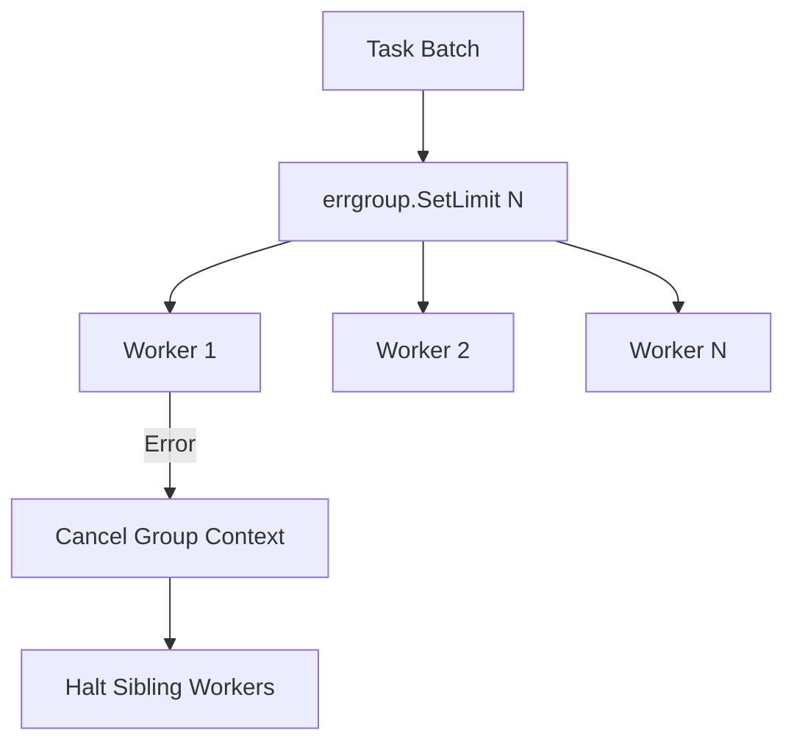

# Decision: Bounded Concurrency via errgroup

## Context
Unbounded goroutine spawning (`for item := range items { go process(item) }`) creates denial-of-service pressure on OS threads, network sockets, and file descriptors.

## Decision
1. **Bounded Parallelism:** When executing collections of concurrent tasks, use `golang.org/x/sync/errgroup` with `g.SetLimit(N)` or worker pool channels.
2. **First-Error Fail-Fast:** Concurrency errors must be captured deterministically and short-circuit sibling tasks.

## Related
* [Context Lifecycle & Goroutine Leak Avoidance](context-propagation.md)
