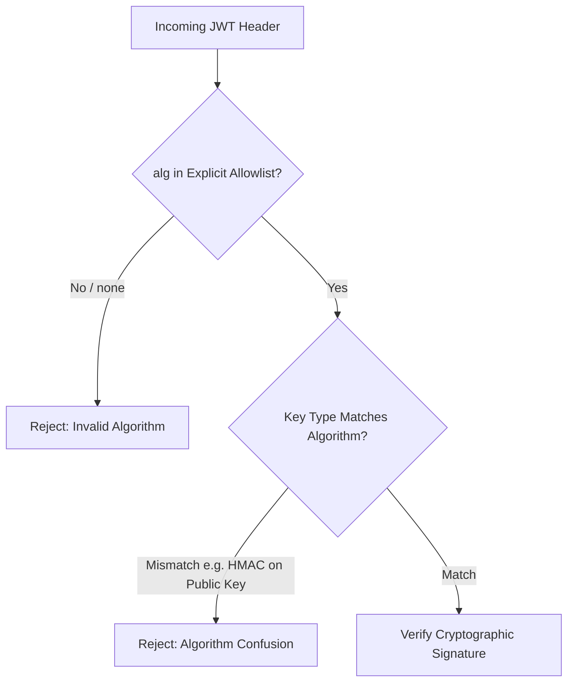

# Decision: JWT Algorithm Enforcement & Scheme Rejection

## Context
JSON Web Tokens encode the signing algorithm in the unverified header (`alg`). Vulnerable parsers historically accepted `alg: "none"` (bypassing signature checks) or allowed HMAC verification of asymmetric public keys (algorithm confusion attacks where the attacker signs with the server's public RSA key as an HMAC secret).

## Decision
1. **Explicit Algorithm Allowlist:** Verifiers MUST specify an explicit allowlist of expected algorithms (e.g. `[RS256]`, `[ES256]`, `[EdDSA]`). Generic or dynamic algorithm negotiation from the header is prohibited.
2. **Unconditional `none` Rejection:** Any token with `alg: "none"` or missing signatures MUST be rejected immediately.
3. **Asymmetric Preference:** Multi-service architectures MUST use asymmetric signatures (RS256, ES256, or Ed25519) so resource servers only require the public key (JWKS) to verify tokens without access to private signing keys.

## Related
* [Claims Validation & Payload Hygiene](claims-hygiene.md)
* [Lifecycle & Refresh Token Rotation](lifecycle-and-rotation.md)
