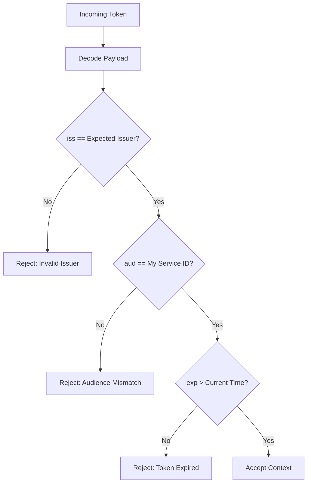

# Decision: Claims Validation & Payload Hygiene

## Context
Developers frequently confuse signed tokens with encrypted tokens. Standard JSON Web Tokens (JWS) are only signed and base64url-encoded; anyone inspecting the network stream or browser memory can read the payload contents in plain text. Furthermore, omitting audience (`aud`) or issuer (`iss`) checks allows cross-service token substitution attacks.

## Decision
1. **Mandatory Standard Claims:** Every issued token MUST contain:
   * `iss` (Issuer): Fully qualified URI of the authentication service.
   * `aud` (Audience): Identifier of the specific intended resource server.
   * `sub` (Subject): Stable user or service UUID.
   * `exp` (Expiration): Unix timestamp of expiration.
   * `iat` (Issued At): Unix timestamp of issuance.
2. **Strict Audience Checking:** Resource servers MUST reject tokens where `aud` does not match their own service identifier.
3. **Zero Sensitive Data in Claims:** Passwords, API keys, credit card numbers, and Personally Identifiable Information (PII) like national IDs or phone numbers MUST NEVER be stored in JWT claims.

## Related
* [Algorithm Enforcement & Insecure Scheme Rejection](algorithm-enforcement.md)
* [Token Storage & Transport Security](storage-and-transport.md)
