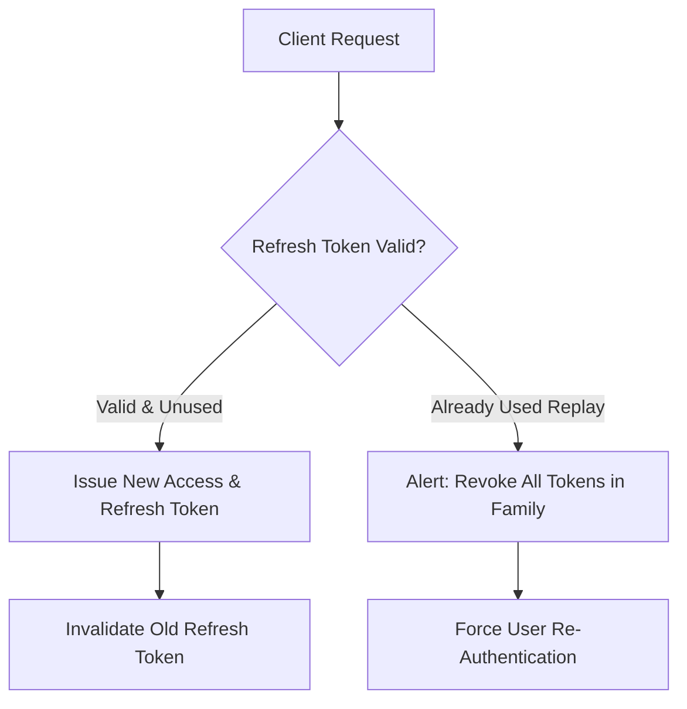

# Decision: Token Lifecycle & Refresh Token Rotation (RTR)

## Context
Stateless JWT access tokens cannot be revoked individually without maintaining server-side blacklists, which destroys the horizontal scalability advantage of stateless authentication. Long-lived access tokens leave large windows of vulnerability if compromised.

## Decision
1. **Short-Lived Access Tokens:** Access tokens MUST have an expiration time (`exp`) between 5 and 15 minutes.
2. **Refresh Token Rotation (RTR):** Every call to `/api/auth/refresh` MUST issue a new access token AND a new refresh token while immediately invalidating the previous refresh token.
3. **Replay Detection & Family Invalidation:** If an already-used refresh token is submitted again, the server MUST treat this as token theft, invalidate the entire token family (all issued refresh tokens for that session), and force immediate re-authentication.

## Related
* [Token Storage & Transport Security](storage-and-transport.md)
* [Claims Validation & Payload Hygiene](claims-hygiene.md)
