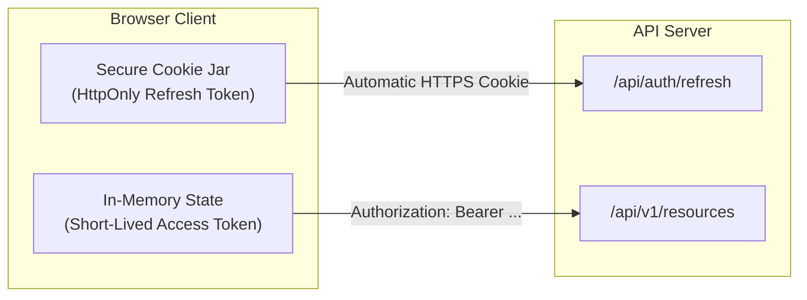

# Decision: Token Storage & Transport Security

## Context
Browser applications that store tokens in `window.localStorage` or `window.sessionStorage` are completely vulnerable to Cross-Site Scripting (XSS) attacks. Any injected JavaScript script (via third-party npm packages, CDN compromises, or unescaped user input) can exfiltrate credentials silently.

## Decision
1. **No Web Storage for Long-Lived Tokens:** Neither access tokens nor refresh tokens may be placed in `localStorage` or `sessionStorage`.
2. **HttpOnly Cookies for Refresh Tokens:** Refresh tokens MUST be transported exclusively via cookies configured with:
   * `HttpOnly`: Prevents client-side JavaScript access.
   * `Secure`: Requires HTTPS transport.
   * `SameSite=Strict` (or `SameSite=Lax` for necessary cross-site top-level navigations): Protects against CSRF attacks.
   * `Path=/api/auth`: Restricts cookie transmission to the dedicated token rotation endpoint.
3. **In-Memory Access Tokens:** Short-lived access tokens should reside exclusively in client runtime memory (e.g. state management or closure variables) and cleared upon page reload or tab closure.

## Related
* [Lifecycle & Refresh Token Rotation](lifecycle-and-rotation.md)
* [Claims Validation & Payload Hygiene](claims-hygiene.md)
