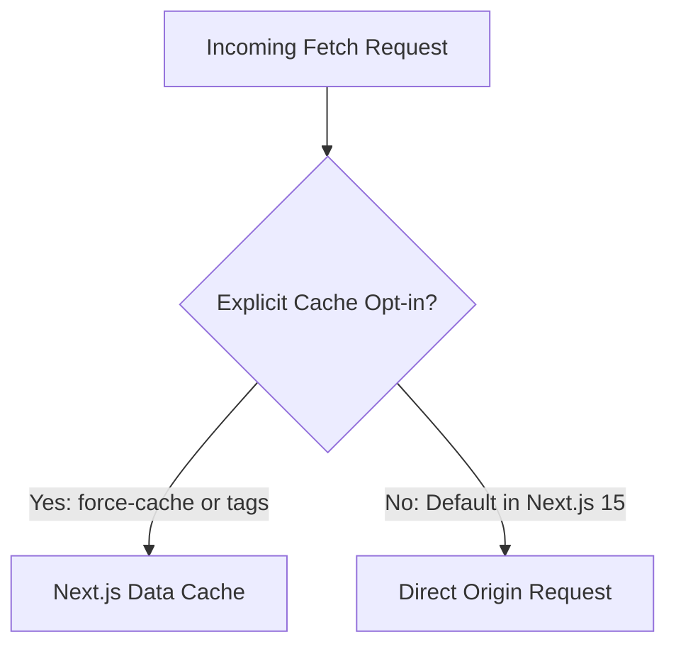

# Decision: Next.js 15 App Router Fetch Caching Defaults

## Context
In Next.js 14 and earlier, `fetch` requests inside Server Components were cached by default (`force-cache`). Next.js 15 changes this behavior: all `fetch` requests now default to `no-store` (uncached) unless explicitly configured otherwise.

## Decision
1. **Explicit Caching:** Whenever persistent HTTP responses are desired across requests, developers MUST explicitly pass `cache: 'force-cache'` or declare `next: { revalidate: <seconds>, tags: [...] }`.
2. **Deterministic Purging:** Dynamic data must be accompanied by tags for cache revalidation via `revalidateTag()`.

## Related
* [Server Actions Security & Error Handling](server-actions.md)
