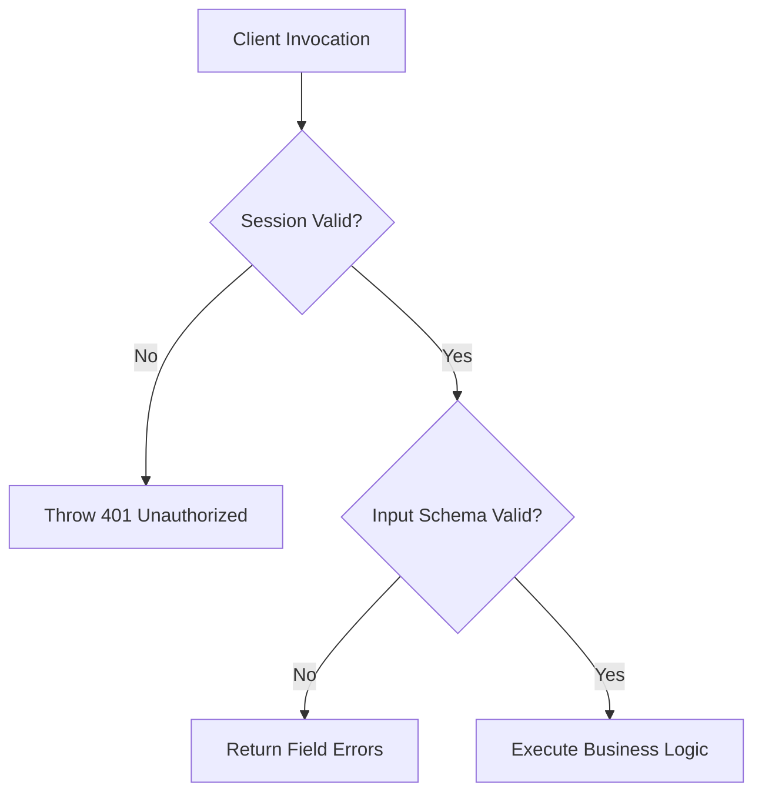

# Decision: Server Actions Security & Error Handling

## Context
Server Actions expose public HTTP POST endpoints under the hood. Unprotected Server Actions are vulnerable to unauthorized execution and sensitive internal stack traces leaking to clients.

## Decision
1. **Schema Validation:** Every Server Action MUST parse input arguments through schema validation before executing business logic.
2. **Sanitized Errors:** Unhandled exceptions must be caught and scrubbed; internal database errors must never be returned directly to the client.

## Related
* [App Router Caching Invariants in Next.js 15](caching.md)
