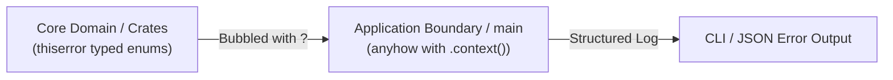

# Decision: Layered Error Handling

## Context
Stringly-typed or unprincipled errors in Rust lead to brittle pattern matching, unhandled edge cases, and cryptic panic cascades under load.

## Decision
1. **Library & Core Domain Boundaries:** Domain crates MUST use `thiserror` to define exhaustive, strongly-typed error enums. Callers must be able to programmatically inspect failure modes.
2. **Application & Binary Roots:** Executable binaries (`main.rs`, CLI handlers, HTTP adapters) MUST use `anyhow::Result<T>` with chained `.context("action description")` calls for rich operational diagnostics.
3. **Panic Prohibition:** Production execution paths MUST NOT invoke `unwrap()`, `expect()`, or `panic!()` outside of compile-time constants or test fixtures.

## Related
* [Zero-Unsafe Invariant & Formal Audit Gate](zero-unsafe.md)
