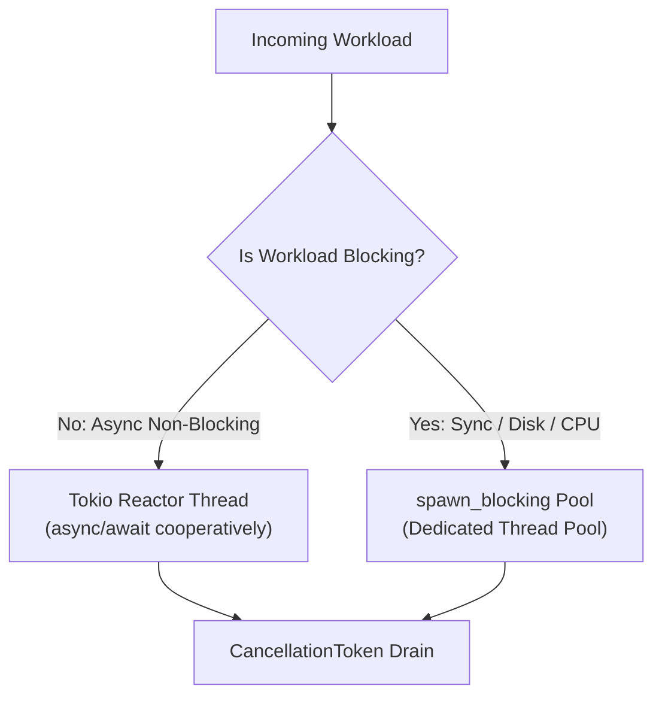

# Decision: Async Tokio Runtime, Cooperative Yielding, and Task Boundaries

## Context
Blocking operations (synchronous disk I/O, heavy cryptographic hashing, synchronous networking) inside asynchronous tasks starve the Tokio reactor thread pool, causing latency spikes and system lockups.

## Decision
1. **Blocking Offload:** Any CPU-intensive operation (>1ms) or synchronous blocking call MUST be dispatched via `tokio::task::spawn_blocking`.
2. **Cancellation-Safe Futures:** Async loops selecting across channels MUST use cancellation-safe futures or state machines to prevent message loss on early return.
3. **Structured Shutdown:** Applications MUST implement graceful shutdown using `tokio::signal::ctrl_c()` and `tokio_util::sync::CancellationToken` to flush active tasks before terminating.

## Related
* [Zero-Unsafe Invariant & Formal Audit Gate](zero-unsafe.md)
