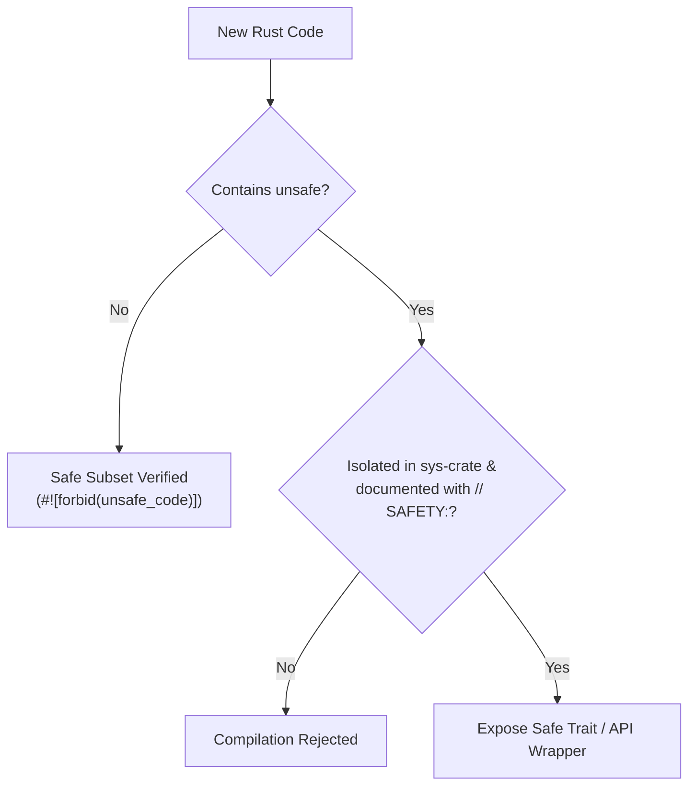

# Decision: Zero-Unsafe Invariant & Formal Audit Gate

## Context
Rust guarantees memory and thread safety as long as code remains within the safe subset. Introducing raw pointers, unchecked conversions, or naked `unsafe` blocks introduces memory corruption, undefined behavior (UB), and concurrency hazards that defeat agent-driven reasoning.

## Decision
1. **Default Prohibition:** All crates MUST declare `#![forbid(unsafe_code)]` at crate root (`lib.rs` or `main.rs`).
2. **Exception Protocol:** If hardware access, foreign function interfaces (FFI), or SIMD require `unsafe`, it MUST be isolated in an independent `sys` sub-crate with a public safe API wrapper.
3. **Audit Documentation:** Any `unsafe` block MUST be preceded by a `// SAFETY:` explanatory comment establishing why the invariant cannot be violated.

## Related
* [Layered Error Handling](error-handling.md)
* [Async Tokio Runtime & Lifecycle](tokio-runtime.md)
